chapter: Annotations

```r
#==================
library(ggplot2)
p <- ggplot(faithful, aes(x=eruptions, y=waiting)) + geom_point()

p + annotate("text", x=3, y=48, label="Group 1") +
    annotate("text", x=4.5, y=66, label="Group 2")
```

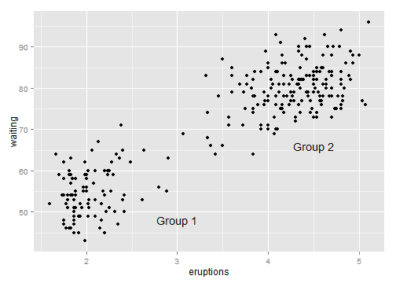 

```r
    
    
#====================================
p + annotate("text", x=3, y=48, label="Group 1", family="serif",
             fontface="italic", colour="darkred", size=3) +
    annotate("text", x=4.5, y=66, label="Group 2", family="serif",
             fontface="italic", colour="darkred", size=3)
```

 

```r
    
    
#====================================
p + annotate("text", x=3, y=48, label="Group 1", alpha=.1) +     # Normal
    geom_text(x=4.5, y=66, label="Group 2", alpha=.1)            # Overplotted
```

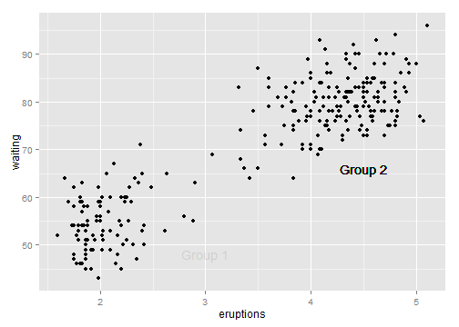 

```r
    
    
#====================================
p + annotate("text", x=-Inf, y=Inf, label="Upper left", hjust=-.2, vjust=2) +
    annotate("text", x=mean(range(faithful$eruptions)), y=-Inf, vjust=-0.4,
             label="Bottom middle")
```

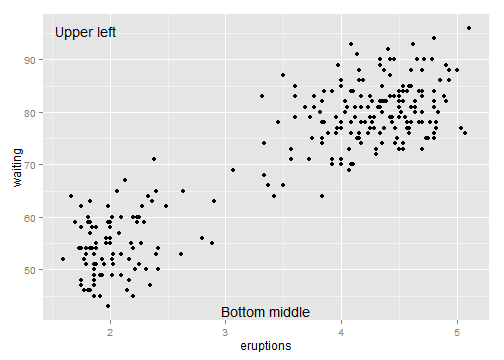 

```r
    
    
#====================================
# A normal curve
p <- ggplot(data.frame(x=c(-3,3)), aes(x=x)) + stat_function(fun = dnorm)

p + annotate("text", x=2, y=0.3, parse=TRUE,
             label="frac(1, sqrt(2 * pi)) * e ^ {-x^2 / 2}")
```

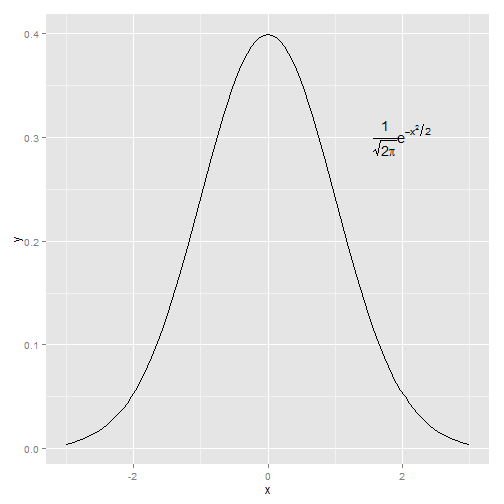 

```r
    
    
#====================================
p + annotate("text", x=0, y=0.05, parse=TRUE, size=4,
             label="'Function:  ' * y==frac(1, sqrt(2*pi)) * e^{-x^2/2}")
```

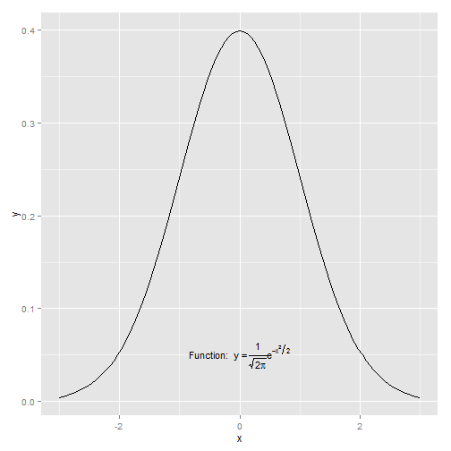 

```r
    
    
#====================================
library(gcookbook) # For the data set

p <- ggplot(heightweight, aes(x=ageYear, y=heightIn, colour=sex)) + geom_point()

# Add horizontal and vertical lines
p + geom_hline(yintercept=60) + geom_vline(xintercept=14)
```

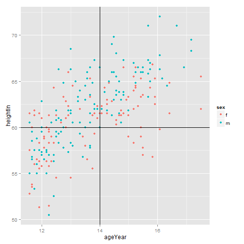 

```r

# Add angled line
p + geom_abline(intercept=37.4, slope=1.75)
```

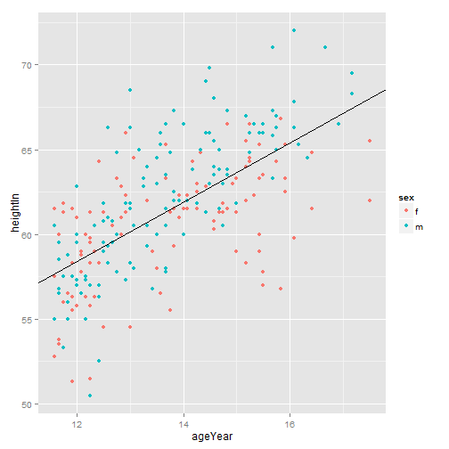 

```r
    
    
#====================================
library(plyr) # For the ddply() function
hw_means <- ddply(heightweight, "sex", summarise, heightIn=mean(heightIn))
hw_means
```

```
##   sex heightIn
## 1   f    60.53
## 2   m    62.06
```

```r

# sex heightIn
   #f 60.52613
   #m 62.06000

p + geom_hline(aes(yintercept=heightIn, colour=sex), data=hw_means,
               linetype="dashed", size=1)
```

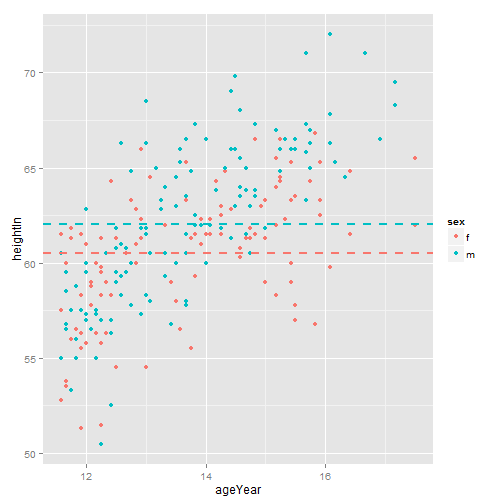 

```r

    
    
#====================================
pg <- ggplot(PlantGrowth, aes(x=group, y=weight)) + geom_point()

pg + geom_vline(xintercept = 2)
```

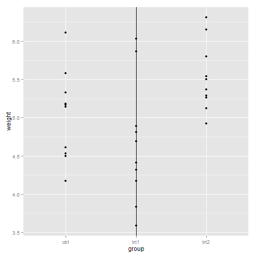 

```r

pg + geom_vline(xintercept = which(levels(PlantGrowth$group)=="ctrl"))
```

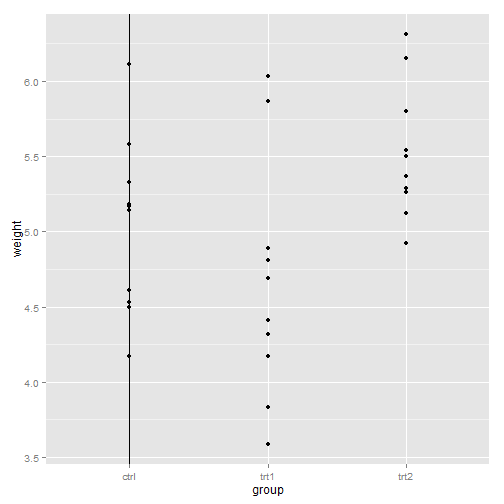 

```r
    
    
#====================================
library(gcookbook) # For the data set

p <- ggplot(subset(climate, Source=="Berkeley"), aes(x=Year, y=Anomaly10y)) +
     geom_line()

p + annotate("segment", x=1950, xend=1980, y=-.25, yend=-.25)
```

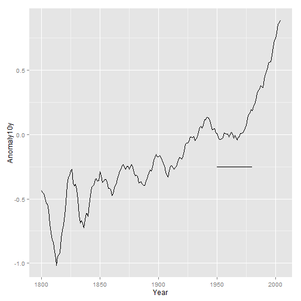 

```r
    
    
#====================================
library(grid)
p + annotate("segment", x=1850, xend=1820, y=-.8, yend=-.95, colour="blue",
             size=2, arrow=arrow()) +
    annotate("segment", x=1950, xend=1980, y=-.25, yend=-.25,
             arrow=arrow(ends="both", angle=90, length=unit(.2,"cm")))
```

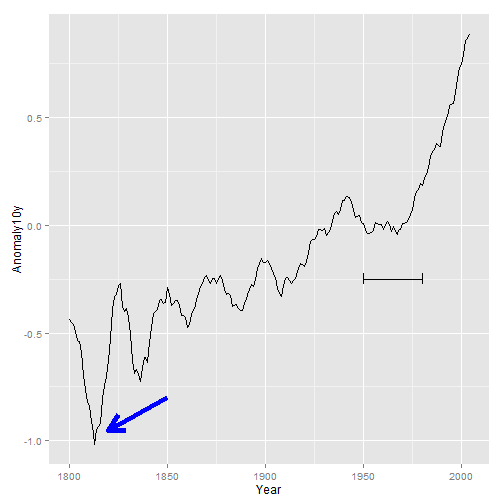 

```r
    
    
#====================================
library(gcookbook) # For the data set

p <- ggplot(subset(climate, Source=="Berkeley"), aes(x=Year, y=Anomaly10y)) +
     geom_line()

p + annotate("rect", xmin=1950, xmax=1980, ymin=-1, ymax=1, alpha=.1,
             fill="blue")
```

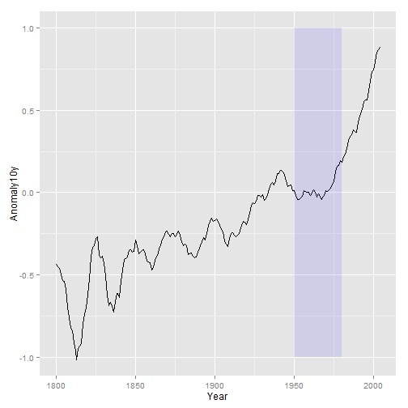 

```r
    
    
#====================================
pg <- PlantGrowth                 # Make a copy of the PlantGrowth data
pg$hl <- "no"                     # Set all to "no"
pg$hl[pg$group=="trt2"] <- "yes"  # If group is "trt2", set to "yes"
    
    
#====================================
ggplot(pg, aes(x=group, y=weight, fill=hl)) + geom_boxplot() +
    scale_fill_manual(values=c("grey85", "#FFDDCC"), guide=FALSE)
```

 

```r
    
    
#====================================
ggplot(PlantGrowth, aes(x=group, y=weight, fill=group)) + geom_boxplot() +
    scale_fill_manual(values=c("grey85", "grey85", "#FFDDCC"), guide=FALSE)
```

 

```r
    
    
#====================================
library(gcookbook) # For the data set
# Take a subset of the cabbage_exp data for this example
ce <- subset(cabbage_exp, Cultivar == "c39")

# With a bar graph
ggplot(ce, aes(x=Date, y=Weight)) +
    geom_bar(fill="white", colour="black") +
    geom_errorbar(aes(ymin=Weight-se, ymax=Weight+se), width=.2)
```

```
## Mapping a variable to y and also using stat="bin".
##   With stat="bin", it will attempt to set the y value to the count of cases in each group.
##   This can result in unexpected behavior and will not be allowed in a future version of ggplot2.
##   If you want y to represent counts of cases, use stat="bin" and don't map a variable to y.
##   If you want y to represent values in the data, use stat="identity".
##   See ?geom_bar for examples. (Deprecated; last used in version 0.9.2)
```

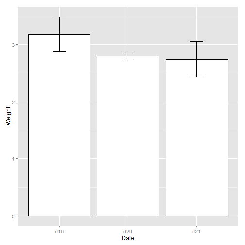 

```r

# With a line graph
ggplot(ce, aes(x=Date, y=Weight)) +
    geom_line(aes(group=1)) +
    geom_point(size=4) +
    geom_errorbar(aes(ymin=Weight-se, ymax=Weight+se), width=.2)
```

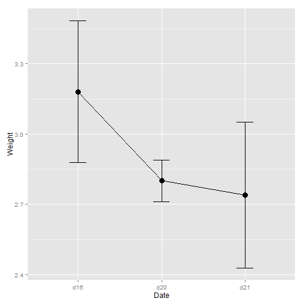 

```r
    
    
#====================================
ce
```

```
##   Cultivar Date Weight     sd  n      se
## 1      c39  d16   3.18 0.9566 10 0.30251
## 2      c39  d20   2.80 0.2789 10 0.08819
## 3      c39  d21   2.74 0.9834 10 0.31098
```

```r

 #Cultivar Date Weight        sd  n         se
      #c39  d16   3.18 0.9566144 10 0.30250803
      #c39  d20   2.80 0.2788867 10 0.08819171
      #c39  d21   2.74 0.9834181 10 0.31098410

    
    
#====================================
cabbage_exp
```

```
##   Cultivar Date Weight     sd  n      se
## 1      c39  d16   3.18 0.9566 10 0.30251
## 2      c39  d20   2.80 0.2789 10 0.08819
## 3      c39  d21   2.74 0.9834 10 0.31098
## 4      c52  d16   2.26 0.4452 10 0.14079
## 5      c52  d20   3.11 0.7909 10 0.25009
## 6      c52  d21   1.47 0.2111 10 0.06675
```

```r

 #Cultivar Date Weight        sd  n         se
      #c39  d16   3.18 0.9566144 10 0.30250803
      #c39  d20   2.80 0.2788867 10 0.08819171
      #c39  d21   2.74 0.9834181 10 0.31098410
      #c52  d16   2.26 0.4452215 10 0.14079141
      #c52  d20   3.11 0.7908505 10 0.25008887
      #c52  d21   1.47 0.2110819 10 0.06674995

    
    
#====================================
# Bad: dodge width not specified
ggplot(cabbage_exp, aes(x=Date, y=Weight, fill=Cultivar)) +
    geom_bar(position="dodge") +
    geom_errorbar(aes(ymin=Weight-se, ymax=Weight+se),
                  position="dodge", width=.2)
```

```
## Mapping a variable to y and also using stat="bin".
##   With stat="bin", it will attempt to set the y value to the count of cases in each group.
##   This can result in unexpected behavior and will not be allowed in a future version of ggplot2.
##   If you want y to represent counts of cases, use stat="bin" and don't map a variable to y.
##   If you want y to represent values in the data, use stat="identity".
##   See ?geom_bar for examples. (Deprecated; last used in version 0.9.2)
```

 

```r

# Good: dodge width set to same as bar width (0.9)
ggplot(cabbage_exp, aes(x=Date, y=Weight, fill=Cultivar)) +
    geom_bar(position="dodge") +
    geom_errorbar(aes(ymin=Weight-se, ymax=Weight+se),
                  position=position_dodge(0.9), width=.2)
```

```
## Mapping a variable to y and also using stat="bin".
##   With stat="bin", it will attempt to set the y value to the count of cases in each group.
##   This can result in unexpected behavior and will not be allowed in a future version of ggplot2.
##   If you want y to represent counts of cases, use stat="bin" and don't map a variable to y.
##   If you want y to represent values in the data, use stat="identity".
##   See ?geom_bar for examples. (Deprecated; last used in version 0.9.2)
```

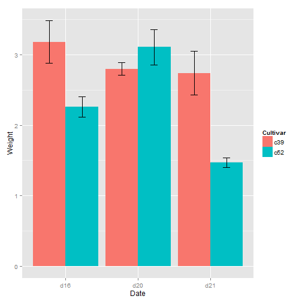 

```r
    
    
#====================================
pd <- position_dodge(.3)  # Save the dodge spec because we use it repeatedly

ggplot(cabbage_exp, aes(x=Date, y=Weight, colour=Cultivar, group=Cultivar)) +
    geom_errorbar(aes(ymin=Weight-se, ymax=Weight+se),
                  width=.2, size=0.25, colour="black", position=pd) +
    geom_line(position=pd) +
    geom_point(position=pd, size=2.5)
```

```
## ymax not defined: adjusting position using y instead
## ymax not defined: adjusting position using y instead
```

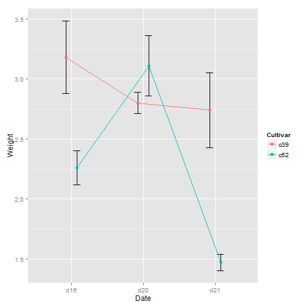 

```r

# Thinner error bar lines with size=0.25, and larger points with size=2.5
    
    
#====================================
# The base plot
p <- ggplot(mpg, aes(x=displ, y=hwy)) + geom_point() + facet_grid(. ~ drv)

# A data frame with labels for each facet
f_labels <- data.frame(drv = c("4", "f", "r"), label = c("4wd", "Front", "Rear"))

p + geom_text(x=6, y=40, aes(label=label), data=f_labels)
```

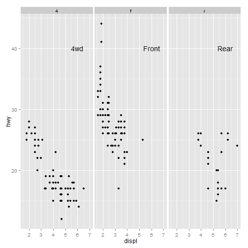 

```r

# If you use annotate(), the label will appear in all facets
p + annotate("text", x=6, y=42, label="label text")
```

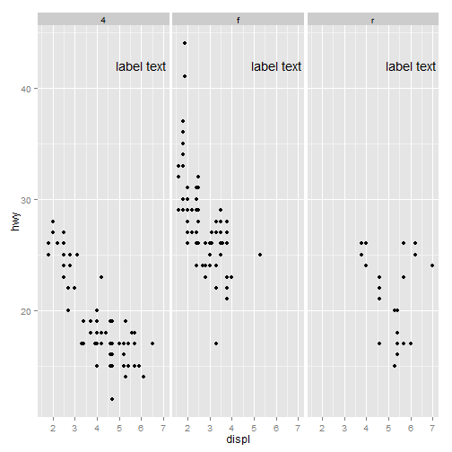 

```r
    
    
#====================================
# This function returns a data frame with strings representing the regression
# equation, and the r^2 value
# These strings will be treated as R math expressions
lm_labels <- function(dat) {
  mod <- lm(hwy ~ displ, data=dat)
  formula <- sprintf("italic(y) == %.2f %+.2f * italic(x)",
                     round(coef(mod)[1], 2), round(coef(mod)[2], 2))

  r <- cor(dat$displ, dat$hwy)
  r2 <- sprintf("italic(R^2) == %.2f", r^2)
  data.frame(formula=formula, r2=r2, stringsAsFactors=FALSE)
}

library(plyr) # For the ddply() function
labels <- ddply(mpg, "drv", lm_labels)
labels
```

```
##   drv                              formula                  r2
## 1   4 italic(y) == 30.68 -2.88 * italic(x) italic(R^2) == 0.65
## 2   f italic(y) == 37.38 -3.60 * italic(x) italic(R^2) == 0.36
## 3   r italic(y) == 25.78 -0.92 * italic(x) italic(R^2) == 0.04
```

```r

 #drv                              formula                  r2
   #4 italic(y) == 30.68 -2.88 * italic(x) italic(R^2) == 0.65
   #f italic(y) == 37.38 -3.60 * italic(x) italic(R^2) == 0.36
   #r italic(y) == 25.78 -0.92 * italic(x) italic(R^2) == 0.04

# Plot with formula and R^2 values
p + geom_smooth(method=lm, se=FALSE) +
    geom_text(x=3, y=40, aes(label=formula), data=labels, parse=TRUE, hjust=0) +
    geom_text(x=3, y=35, aes(label=r2), data=labels, parse=TRUE, hjust=0)
```

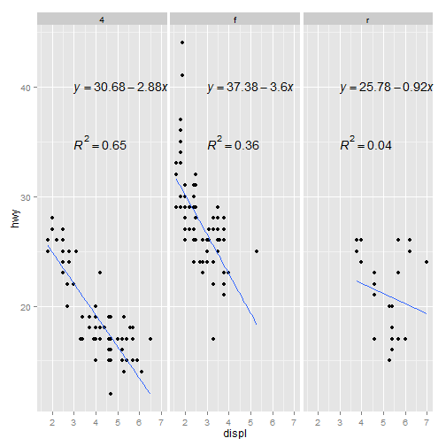 

```r
    
    
#====================================
# Find r^2 values for each group
labels <- ddply(mpg, "drv", summarise, r2 = cor(displ, hwy)^2)
labels$r2 <- sprintf("italic(R^2) == %.2f", labels$r2)
    
    
#==================
```

